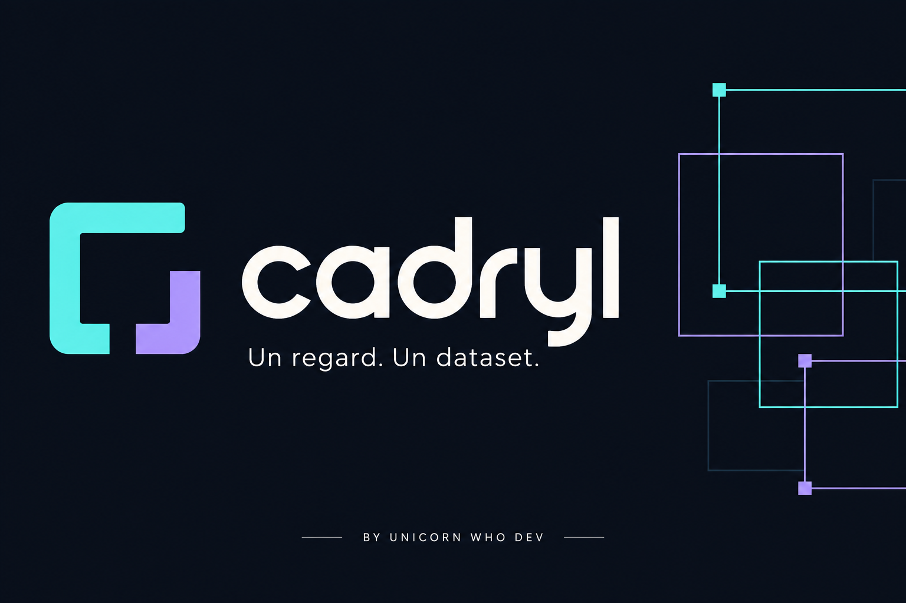
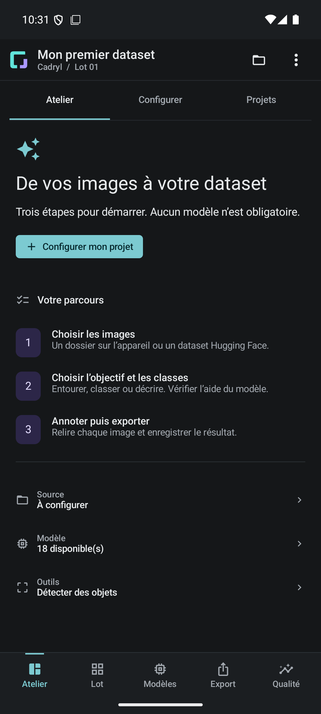

# Cadryl

**An Android workspace for turning images into datasets.**

Import your images, review the model’s suggestions, make your corrections and export. Cadryl brings those steps together while keeping your annotations in your hands. You can work entirely by hand, or train a compatible model on batches you have reviewed.

An independent project by **Unicorn Who Dev**, previously called *Vision Dataset Studio*.

[Get rc8](https://github.com/unicornwhodev/cadryl_android_dataset_and_litert_train/releases/tag/v4.2.0-rc8) · [Your first batch](docs/en/GETTING_STARTED.md) · [Documentation](docs/en/README.md) · [Français](README.md)

## New in rc8

Safer source paging, restored batch state, a four-step guide and preserved model contracts. Real private HF/SAF fault tests, 1,000 public CC0 images on Oppo and ten minutes of inference on Honor. [Release details](docs/RC8_RELEASE.md).

## What you can do

- **Organise images.** Use a local folder or Hugging Face source, process small batches, track duplicates and return to your project later.
- **Annotate with some help.** Boxes, points and masks: the model suggests, you edit and decide. Saved human corrections stay protected.
- **Export a usable dataset.** Keep the full JSONL, plus COCO, YOLO, WebDataset or vision-language exports where appropriate. Copies must be read back before cleanup.
- **Keep improving a model copy.** The first training run creates a separate version. Later runs continue from its last validated weights. The original remains available.

Training is optional and off by default. **The APK includes no model weights or datasets.** Manual annotation works without a model.

## Inside the app

This is a real emulator screenshot. The banner is an illustration; [visual sources are documented](docs/VISUALS.md).

## Try it

You need **Android 9 or later and an ARM64 phone**. Download `vision-dataset-studio.apk` from the release and start with a few images you have permission to use. The technical APK filename and Android application ID stay unchanged for continuity.

**Already using rc4 or rc5?** Those Debug APKs use different signing keys. rc7 cannot update them directly; keep the installation and its data. [Installation and signing](docs/en/GETTING_STARTED.md#install-cadryl).

The documented public model sources are [Charlbi’s conversions](https://huggingface.co/Charlbi/Lite_rt_prepared_for_android_dataset_builder) and [FireViewer’s models](https://huggingface.co/fireviewer/litert-models). Check each variant’s results before choosing it. Loading successfully says nothing about accuracy on your images.

## Project status

**4.2.0-rc8 is a prerelease.** Real Android builds, 106 JVM tests, 93 Python tests and KSP schemas. All 53 Android tests pass on native x86/API 36/16 KB and on physical Honor and Oppo ARM64/4 KB. Four independent UI scenarios pass on Oppo and the emulator. Private authorized HF publication/faults, real SAF failures, 1,000 CC0 photos and ten-minute physical inference have separate receipts. [Executed scopes](docs/RC8_QUALIFICATION_2026_09.md).

Physical ARM/16 KB, FireViewer accuracy, real complete/partial Viewer flow, background endurance, remote CI and native transitive notices remain open. [Test results](docs/en/VALIDATION.md) · [Known limits](docs/en/KNOWN_LIMITATIONS.md).

## Work on the app

The app uses **Kotlin, Compose, Room and LiteRT**. The [development guide](docs/en/DEVELOPMENT_RESUME.md) covers native dependencies, Windows/Linux builds and tests. Start with the [architecture](docs/en/ARCHITECTURE.md) to find your way around the code.

Found a bug or have an idea? [Open an issue](https://github.com/unicornwhodev/cadryl_android_dataset_and_litert_train/issues) with the version, device and steps to reproduce. Contributions are welcome; see [CONTRIBUTING.md](CONTRIBUTING.md).

Project code is [Apache-2.0](LICENSE). Models, datasets and third-party components retain their own terms. [Licensing status](LICENSING_STATUS.md).
