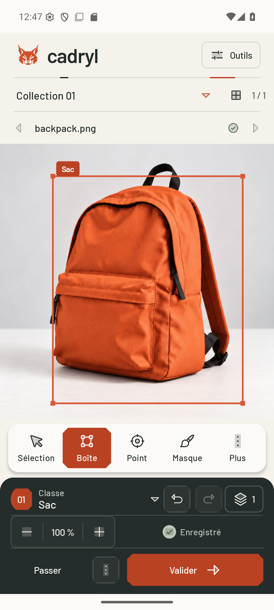

# Cadryl

**An Android workspace for turning images into datasets.**

Import your images, review the model’s suggestions, make your corrections and export. Cadryl brings those steps together while keeping your annotations in your hands. You can work entirely by hand, or train a compatible model on batches you have reviewed.

An independent project by **Unicorn Who Dev**, previously called *Vision Dataset Studio*.

[Release 0.0.1](https://github.com/unicornwhodev/cadryl_android_dataset_and_litert_train/releases/tag/v0.0.1) · [Your first batch](docs/en/GETTING_STARTED.md) · [Documentation](docs/en/README.md) · [Français](README.md)

## Current studio sources

Selected lynx, bundled Barlow fonts, Phosphor Duotone icons and porcelain/graphite/vermilion surfaces. **Tools** opens models, training, imports and exports; the editor console groups its commands. [Studio guide](docs/STUDIO_UI_2026_09.md) · [Visual QA](design-qa.md) · [Redesign evidence](docs/STUDIO_UI_EVIDENCE.json).

The published `v0.0.1` release retains its original APKs and interface. The redesign is built and tested in current sources; it has not replaced those published assets.

A new **signed ARM64 AAB** has been built locally, with its bundle-derived APK and paired instrumentation tests. [Build recipe, hashes and qualification scope](docs/APP_BUNDLE.md). Current Debug core checks pass 63/63; the new bundle-derived APK still needs physical-device qualification after the phone disconnected.

## Public release 0.0.1

Simpler studio, interactive first-launch tutorial, safer imports and exports, adaptive Cadryl icons and offline notices. Models and training remain available. The final tutorial checkbox disables future automatic starts; Settings can replay it.

Apache-2.0 sources build without advertising, subscriptions or a Cadryl backend. [Release notes](docs/RELEASE_001.md) · [Exact evidence](docs/RELEASE_001_EVIDENCE.json) · [Privacy cleanup](docs/PRIVACY_REDACTION_2026_09.md).

## What you can do

- **Organise images.** Use a local folder or Hugging Face source, process small batches, track duplicates and return to your project later.
- **Annotate with some help.** Boxes, points and masks: the model suggests, you edit and decide. Saved human corrections stay protected.
- **Export a usable dataset.** Keep the full JSONL, plus COCO, YOLO, WebDataset or vision-language exports where appropriate. Copies must be read back before cleanup.
- **Keep improving a model copy.** The first training run creates a separate version. Later runs continue from its last validated weights. The original remains available.

Training is optional and off by default. **The APK includes no model weights or datasets.** Manual annotation works without a model.

## Inside the app

Actual API 36 emulator screenshot of the redesign Debug APK, using an authorized synthetic image and a saved human annotation. [APK binding](docs/studio/capture.json) · [Visual provenance](docs/VISUALS.md).

## Try it

You need **Android 9 or later and an ARM64 phone**. Download `vision-dataset-studio.apk` from the release and start with a few images you have permission to use. The technical APK filename and Android application ID stay unchanged for continuity.

**Already using rc4 or rc5?** Those Debug APKs use different signing keys. 0.0.1 cannot update them directly; keep the installation and its data. [Installation and signing](docs/en/GETTING_STARTED.md#install-cadryl).

The documented public model sources are [Charlbi’s conversions](https://huggingface.co/Charlbi/Lite_rt_prepared_for_android_dataset_builder) and [FireViewer’s models](https://huggingface.co/fireviewer/litert-models). Check each variant’s results before choosing it. Loading successfully says nothing about accuracy on your images.

## Project status

Actual Android builds, JVM/lint/KSP checks, Android core suites and independent physical-device UI checks have separate receipts. [Current results](TEST_REPORT.md). Historical RC8 external-service, corpus and endurance campaigns retain their original scope. [Known limitations](KNOWN_LIMITATIONS.md).

## Work on the app

The app uses **Kotlin, Compose, Room and LiteRT**. The [development guide](docs/en/DEVELOPMENT_RESUME.md) covers native dependencies, Windows/Linux builds and tests. Start with the [architecture](docs/en/ARCHITECTURE.md) to find your way around the code.

Found a bug or have an idea? [Open an issue](https://github.com/unicornwhodev/cadryl_android_dataset_and_litert_train/issues) with the version, device and steps to reproduce. Contributions are welcome; see [CONTRIBUTING.md](CONTRIBUTING.md).

Project code is [Apache-2.0](LICENSE). Models, datasets and third-party components retain their own terms. [Licensing status](LICENSING_STATUS.md).

## Local builds

No GitHub Actions workflows. Build, test and signing scripts run locally.
